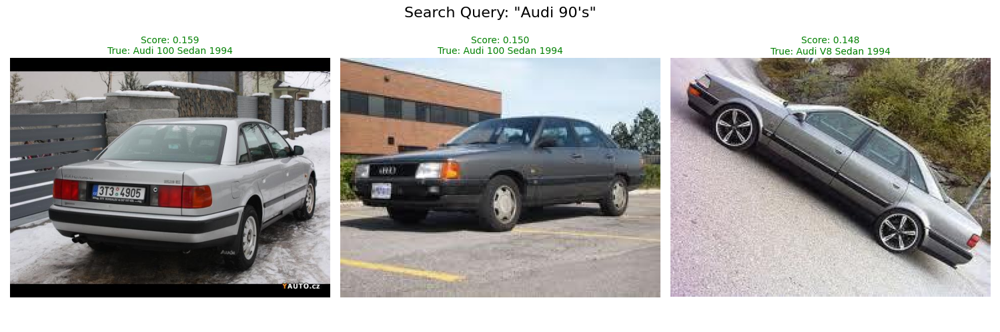
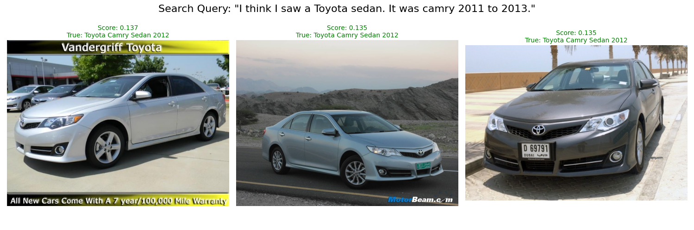

# 🚓 Fine-Tuned Multimodal Vehicle Retrieval (SigLIP + FAISS)

An end-to-end, production-ready Vision-Language Model (VLM) pipeline designed for high-precision, cross-modal vehicle retrieval. This system allows a user to type organic, natural-language search queries (e.g., *"red 2012 chevy pickup"* or *"older model mercedes coupe"*) and retrieve specific vehicle instances from a visual database in milliseconds.

This repository demonstrates a complete ML lifecycle: **LLM-Augmented Data Engineering**, **Parameter-Efficient Fine-Tuning (PEFT)** of dual encoders, **Mathematical Optimization** of the SigLIP Pairwise Loss, and **High-Performance Vector Search** via FAISS.

## 🧠 Architectural Highlights & Design Decisions

In the VLM architecture, several deliberate design choices were made to optimize for domain-specific retrieval rather than generalized VQA:

* **Dual-Encoder LoRA Injection:** Unlike standard Generative VLM pipelines (which freeze the vision encoder to preserve zero-shot world knowledge), this architecture injects LoRA adapters into the `query` and `value` projection matrices of **both** the Vision and Text transformers. This is critical for *fine-grained instance retrieval*, forcing the model to learn hyper-specific automotive geometries (e.g., the grill difference between a 2009 and 2012 Dodge Ram) while adapting the text encoder to messy, human-typed search queries.
* **Pairwise Sigmoid Loss vs. InfoNCE:** Standard CLIP relies on Softmax (InfoNCE) loss, which requires massive batch sizes (4k-32k) for stable contrastive learning. This pipeline utilizes Google's SigLIP architecture, which uses a Pairwise Sigmoid loss. This mathematically decouples the loss from the global batch size, allowing for state-of-the-art contrastive learning on a single GPU using Gradient Accumulation.
* **Dynamic Bias Calibration:** The `peft` library inherently freezes raw scalar parameters. This pipeline implements a surgical unfreeze of SigLIP's `logit_scale` and `logit_bias`. By unfreezing the bias, the model dynamically recalibrates its prior probability to match the local accumulated batch size.
* **LLM-as-a-Judge Synthetic Data Guardrails:** To simulate real-world dispatcher queries, an offline 14B parameter LLM (`qwen2.5:14b`) generates synthetic syntactic variance. To prevent contrastive poisoning, a deterministic LLM-as-a-Judge schema enforces strict negative constraints (blocking hallucinated colors, backgrounds, or aftermarket parts) via Pydantic structured outputs.
* **Fast Inference (FAISS):** The retrieval engine uses `FAISS IndexFlatIP`. By L2-normalizing the embeddings prior to ingestion, we mathematically convert the highly optimized Inner Product search into exact Cosine Similarity.

## 🗄️ Dataset: Stanford Cars

This project uses the **Stanford Cars** dataset, which contains 16,185 images of 196 classes of cars. The data is split into 8,144 training images and 8,041 testing images.

*(Note: The original Stanford University hosting link is currently offline. The dataset must be acquired via other sources, such as Kaggle or GitHub).*

**Download Instructions:**
Download the dataset by cloning from this repository's mirror:
   ```bash
   git clone https://github.com/jhpohovey/StanfordCars.git
   ```
Extract the contents and organize them into the data/ directory so they match the structure expected by the utils.py parser:

    .
    data/
    └── stanford_cars/
        ├── cars_meta.mat
        ├── cars_train_annos.mat
        ├── cars_test_annos_withlabels.mat
        ├── cars_train/       # Directory containing training JPEGs
        └── cars_test/        # Directory containing testing JPEGs

## 📂 Repository Structure

    .
    ├── README.md
    ├── src
        ├── dataloader.py    # DDP-compliant data loaders & ViT preprocessing
        ├── dataset.py       # Custom PyTorch Dataset with OpenCV fallback handling
        ├── evaluate.py      # Vectorized metrics engine (Recall@K, mAP, MRR)
        ├── retrieve.py      # FAISS indexing and Interactive CLI deployment
        ├── text_aug.py      # LLM synthetic data generation with Pydantic guardrails
        ├── train.py         # Main training loop (DDP, AMP, Grad Accumulation)
        └── utils.py         # Legacy MATLAB annotation parsing

## 🚀 Quickstart & Execution Pipeline

### 1. Environment Setup
Make sure you are in a virtual python environment, so that installed dependencies do not alter your system-wide python packages. Then, run:

    pip install -r requirements.txt

*Note: If running on a local NVIDIA GPU, install `faiss-gpu` for accelerated indexing.*

### 2. Phase I: Synthetic Data Engineering
Generate messy, organic search queries for the Stanford Cars dataset using a local LLM. This requires Ollama running locally.

    # Pull the 14B reasoning model
    ollama pull qwen2.5:14b

    # Run the augmentation script
    python text_aug.py

### 3. Phase II: Model Fine-Tuning
Execute the training loop. The script is `torchrun` and DDP-ready, utilizes Automatic Mixed Precision (BFloat16 to prevent gradient underflow), and implements Cosine Annealing with a linear warmup.

    # For single-node/local GPU training:
    torchrun --nproc_per_node=1 train.py

    # or simply
    python train.py


*The script will automatically run a Zero-Shot baseline evaluation, train the LoRA adapters, evaluate the newly trained weights, and save the metrics to `evaluation_results.json`.*

### 4. Phase III: Production Retrieval (FAISS)
Launch the interactive terminal to query the database in real-time. The script decouples the encoders, caching the visual embeddings offline and only running the lightweight text-transformer during live inference.

    python retrieve.py

## 📸 Retrieval Examples

Here are a few examples of the model successfully retrieving specific vehicle instances from the database using natural-language queries. Notice how the model correctly ignores syntactic noise and hones in on the specific make, model, and trim.

<p align="center">
  
  
  
  
  
</p>

The following exmaple also shows a query with the third results being incorrect. The mistaken car is visually very similar to the queried car.

<p align="center">
  
</p>

*Note: The confidence scores displayed above are raw FAISS cosine similarities.*

## 📊 Evaluation Metrics

*The baseline model possesses generalized automotive knowledge, but fine-tuning the dual-encoders drastically improves the model's ability to discriminate between specific trims and model years.*

| Metric | Zero-Shot Baseline (SigLIP Base) | Fine-Tuned (Dual LoRA) |
| :--- | :--- | :--- |
| **Recall@1** | 94.39% | **98.52%** |
| **Recall@5** | 99.51% | **100.00%** |
| **mAP** | 88.67% | **92.79%** |
| **MRR** | 0.9673 | **0.9917** |

## 🌐 System Design: Scaling to Production
While this repository runs locally, the architecture is designed to scale:
1. **Edge vs. Cloud:** The Vision Encoder (`vision_model`) can be exported via ONNX/TensorRT and deployed directly to edge systems to extract embeddings at the source, drastically reducing network bandwidth.
2. **Streaming Vector DBs:** For real-time deployment, the static FAISS index could be replaced by a distributed streaming vector database (e.g., Milvus or Pinecone) capable of handling millions of continuous UPSERT operations as new vehicle images arrive.
3. **Continuous Metric Monitoring:** Post-deployment, data drift could be monitored by tracking the density of the FAISS clusters. Unrecognized vehicles (e.g., a newly released 2026 model year) will form isolated latent clusters, triggering automated data-flywheel retraining loops.

---
